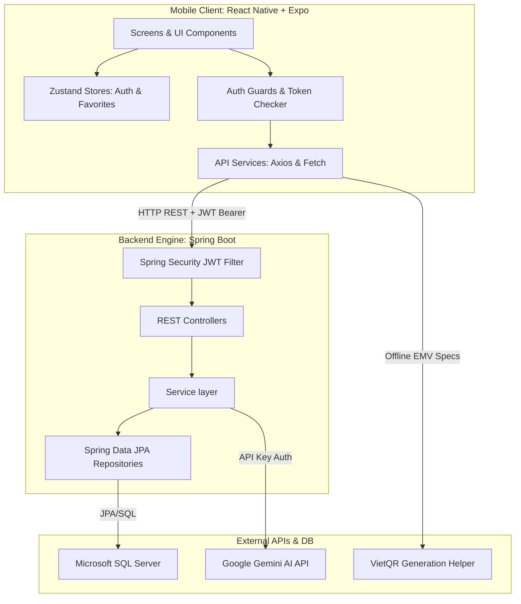
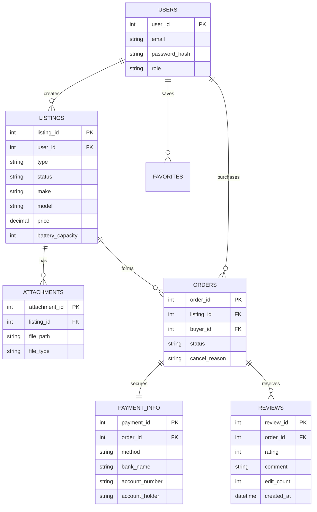
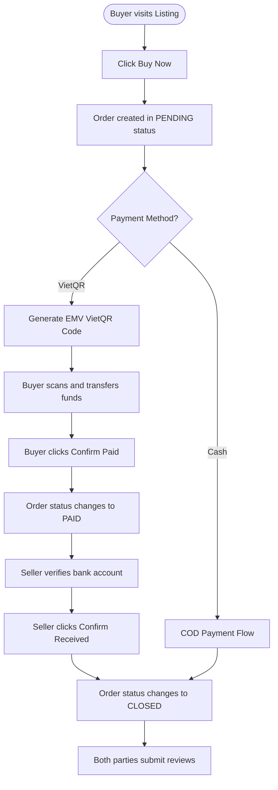
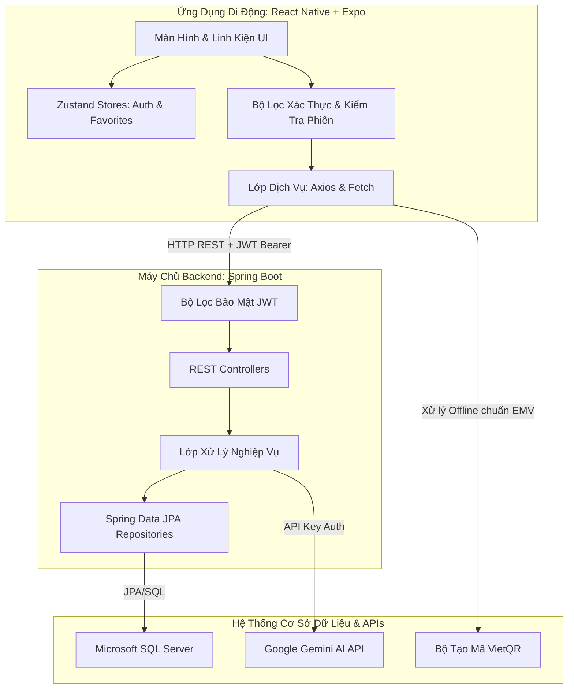
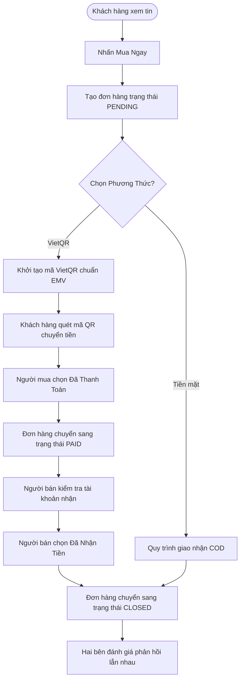

#  iHeartEV - Second-hand EV & Battery Trading Platform

<div align="center">

  
  
  
  
  

  **A modern, AI-powered e-commerce ecosystem built for trading pre-owned Electric Vehicles (EVs) and Batteries. Features automatic vehicle evaluation, AI-generated price suggestions, EMV-compliant VietQR payments, and comprehensive order lifecycle management.**

  [ Phiên Bản Tiếng Việt](#phiên-bản-tiếng-việt) | [ English Version](#english-version)

</div>

---

#  English Version

## 1. Project Title
<div align="center">
  <h2>⚡ iHeartEV — AI-Powered Second-Hand EV & Battery Marketplace</h2>
</div>

---

## 2. Project Overview
**iHeartEV** is a premium, full-stack trading application built for the **MMA301 (Mobile Application Development)** course at FPT University. The platform provides a secure and specialized marketplace for second-hand Electric Vehicles (EVs) and EV Batteries. 

By coupling a **Spring Boot** REST backend with a native **React Native (Expo)** client, the platform delivers specialized features:
*   **🤖 AI Appraisals:** Generates automated vehicle assessments and market pricing suggestions using the Google Gemini API.
*   **💳 VietQR Generation:** Instantly creates EMV-compliant banking QR codes, supporting instant bank transfers.
*   **🛡️ Secure Order Lifecycle:** Tracks transactions from creation to closure, with double-sided review validations and edit safeguards (maximum of 2 edits within 90 days).
*   **📁 Attachment Manager:** Handles multi-file uploads (up to 5 images and 1 video) with a custom fullscreen video player.

---

## 3. Executive Summary
iHeartEV addresses the challenges of trading used electric vehicles. Standard e-commerce templates lack mechanisms to evaluate battery health (SoH) or verify seller credibility. 

This platform addresses these issues through:
1.  **AI Insights Engine:** Uses Google Gemini models (`gemini-2.0-flash-lite`) to evaluate listings, calculate pricing suggestions, and analyze transaction histories.
2.  **Robust Architecture:** Employs a Java Spring Boot backend connecting to Microsoft SQL Server, secured via JWT authorization filters.
3.  **Modern UI/UX:** Built with React Native, Expo, and Zustand, featuring debounced catalog search, connection-retry modales, keyboard-safe layouts, and local storage state persistence.

---

## 4. Key Features
*   **🔐 JWT Authentication:** Session path guards separating Members from Administrators, with token expiration handling and automatic logouts.
*   **📦 Listing Management:** Supports active attachments manager (add/remove images/videos), drafts, and sold status management for both vehicles and standalone batteries.
*   **🤖 Gemini AI Integration:** Automated fallback checks across multiple Gemini models to evaluate pricing and inspect vehicle descriptions.
*   **💳 Dynamic VietQR Payments:** Generates standard EMV bank transfer QR codes based on user bank selection, account details, and purchase totals.
*   **🛒 Order Lifecycle Engine:** Models transaction statuses (`PENDING`, `PAID`, `CANCELLED`, `CLOSED`) with user-cancellation capabilities.
*   **💬 Two-Way Reviews:** Feedback loops allowing buyers and sellers to rate each other, protected by validation rules and edit limits.
*   **🎥 Attachment Media Player:** Fullscreen video player with playback, volume, and zoom controls.

---

## 5. User Roles
The iHeartEV ecosystem divides operations into three primary user groups:

### 👤 Member (Buyer / Seller)
*   **As a Seller:** Creates listings, configures payment preferences (VietQR bank choices or Cash), uploads vehicle media, reviews AI price suggestions, tracks incoming orders, confirms receipt of funds, and rates buyers.
*   **As a Buyer:** Explores vehicles, reviews AI condition appraisals, favorites items, initiates purchases via VietQR/COD, confirms payment transfers, and rates sellers.

### 🛡️ Administrator
*   **Scope:** Grants verified status to vehicle listings, reviews activity reports, manages accounts, and flags fraudulent listings.

### 🎓 Course Grader / Instructor
*   **Scope:** Evaluates codebase modularity, reviews API contracts via Swagger UI, and runs verification checks on the integration points (Gemini API, VietQR generator, and file handlers).

---

## 6. Use Cases
1.  **Creating a Listing with AI Price Recommendation:** A seller uploads 3 images of a used Tesla Model 3 and enters basic parameters. The client calls the Gemini API to get a recommended price range. The seller sets their price, configures a VietQR payment method, and publishes the listing.
2.  **VietQR Purchase & Order Closure:** A buyer clicks "Buy Now" on an EV. The app generates a customized QR code. The buyer scans the QR code to send the bank transfer and clicks "Confirm Paid". The seller verifies their bank account, clicks "Confirm Received", closes the order, and both parties leave a rating.
3.  **Review Modification Constraints:** A user attempts to update a rating. The backend checks the edit history for the review. If the user has edited the review fewer than 2 times and it is within the 90-day window, the change is saved; otherwise, the request is rejected with a validation error.

---

## 7. System Architecture
The application uses a decoupled client-server architecture:



---

## 8. Technology Stack
*   **Backend Framework:** Spring Boot 3.5.7 (Java 17).
*   **Security:** Spring Security, JWT (JSON Web Tokens).
*   **Database:** Microsoft SQL Server, Hibernate ORM, Spring Data JPA.
*   **AI Integration:** Google Gemini API (`gemini-2.0-flash-lite` with fallback models).
*   **Mobile App:** React Native, Expo.
*   **State Management:** Zustand.
*   **Network Client:** Axios (REST calls), Fetch (Multipart FormData uploads).
*   **APIs & Spec Documentation:** Swagger UI / OpenAPI 3.

---

## 9. Project Structure
```text
iheartev/
├── backend/                      # Spring Boot Backend Project
│   ├── src/main/java/com/iheartev/api/
│   │   ├── admin/                # Admin verification controllers & services
│   │   ├── ai/                   # Gemini API communication wrappers
│   │   ├── attachment/           # Media upload, download & preview logic
│   │   ├── auth/                 # Signup, login & token controllers
│   │   ├── listing/              # Vehicle/Battery listings CRUD
│   │   ├── me/                   # Profile & user-centric query paths
│   │   ├── payment/              # Payment options and bank list adapters
│   │   ├── security/             # JWT filters, entry points & CORS
│   │   ├── social/               # Favorite toggle & rating controllers
│   │   ├── transaction/          # Orders, order lifecycle, AI Insights
│   │   └── user/                 # Buyer/Seller profile evaluations
│   ├── src/main/resources/
│   │   ├── application.properties # Main application properties
│   │   └── data.sql              # Database seed data
│   ├── uploads/                  # Physical disk storage for attachments
│   └── pom.xml                   # Maven dependencies config
├── mobile/                       # React Native Mobile Project
│   ├── src/
│   │   ├── screens/              # Screens (HomeScreen, OrderDetailScreen, etc.)
│   │   ├── components/           # UI elements (ConnectionErrorModal, etc.)
│   │   ├── services/             # Axios API network calls
│   │   ├── store/                # Zustand stores
│   │   ├── hooks/                # Route guards and token checks
│   │   └── utils/                # Formatters and EMV VietQR generators
│   └── package.json              # Javascript dependencies config
```

---

## 10. Core Business Logic
*   **AI Model Fallback:** The backend handles potential rate limits or API outages by automatically falling back to alternative models:
    ```java
    public String generateAIResponse(String prompt) {
        try {
            return callGeminiAPI("gemini-2.0-flash-lite", prompt);
        } catch (Exception e) {
            log.warn("Gemini Flash Lite failed, falling back to gemini-2.0-flash");
            return callGeminiAPI("gemini-2.0-flash", prompt);
        }
    }
    ```
*   **Review Modification Limits:** The system enforces review integrity by validating update counts:
    ```java
    if (review.getEditCount() >= 2) {
        throw new IllegalStateException("Review cannot be edited more than 2 times.");
    }
    if (ChronoUnit.DAYS.between(review.getCreatedAt(), Instant.now()) > 90) {
        throw new IllegalStateException("Review edit window of 90 days has expired.");
    }
    ```

---

## 11. Database Design
The relational schema maps transactions, listings, payments, and reviews:



---

## 12. API Documentation

### 🔑 Authentication (`/api/auth`)
*   `POST /signup` - Register a Member account.
*   `POST /login` - Login to receive a JWT access token.

### 🚗 Vehicle & Battery Listings (`/api/listings`)
*   `GET /` - Dynamic search and filter listings catalog.
*   `POST /` - Create a listing. Requires image/video uploads.
*   `PUT /:id` - Update listing details and modify attachments.
*   `POST /:id/ai-eval` - Calls Gemini AI to evaluate a listing.

### 🛍️ Transactions & Orders (`/api/orders`)
*   `POST /` - Place a purchase order (Buy Now).
*   `GET /:id/ai-insights` - Generates seller credibility and pricing insights.
*   `PUT /:id/cancel` - Cancel an order with a cancellation reason.
*   `PUT /:id/confirm-paid` - Confirm payment (Buyer action).
*   `PUT /:id/confirm-received` - Confirm receipt of funds (Seller action).

---

## 13. Authentication & Authorization
*   **JWT Security Filter:** A custom interceptor inspects the `Authorization` header for a `Bearer <token>` string and verifies the signature using the configured secret key.
*   **Session Expiration Handling:** The React Native client checks the token validity period. If expired, it displays a logout notice and redirects to the login screen.

---

## 14. Application Workflow
The purchase and payment verification workflow is structured as follows:



---

## 15. Installation Guide

### Prerequisites
*   **Java:** JDK 17 or higher.
*   **Build Tools:** Maven 3.6+.
*   **Node.js:** v18.x or v20.x.
*   **Database:** Microsoft SQL Server.
*   **Mobile Tooling:** Expo CLI (`npm install -g expo-cli`).

### Step-by-Step Installation

#### 1. Database Configuration
Create a database named `iheartev` in your SQL Server instance.

#### 2. Backend Server Setup
1.  Navigate to the backend directory:
    ```bash
    cd backend
    ```
2.  Configure environment variables in a `.env` file or your system properties:
    ```properties
    DB_URL=jdbc:sqlserver://localhost:1433;databaseName=iheartev;trustServerCertificate=true
    DB_USER=sa
    DB_PASSWORD=your_sql_server_password
    GEMINI_API_KEY=your_google_gemini_api_key
    JWT_SECRET=your_base64_encoded_jwt_signing_key
    ```
3.  Build and run the backend application:
    ```bash
    ./mvnw spring-boot:run
    ```

#### 3. Mobile Client Setup
1.  Navigate to the mobile directory:
    ```bash
    cd mobile
    npm install
    ```
2.  Install dependencies:
    ```bash
    npx expo install expo-image-picker
    ```
3.  Configure the API server address in `.env`:
    ```ini
    EXPO_PUBLIC_API_URL=http://your-local-ip:3000
    ```
4.  Start the Expo development server:
    ```bash
    npm start
    ```

---

## 16. Configuration
*   `backend/src/main/resources/application.properties`:
    ```properties
    spring.datasource.url=${DB_URL}
    spring.datasource.username=${DB_USER}
    spring.datasource.password=${DB_PASSWORD}
    spring.servlet.multipart.max-file-size=10MB
    spring.servlet.multipart.max-request-size=10MB
    ```
*   `mobile/package.json`: Manages Expo packages, UI icons, and network request wrappers.

---

## 17. Development Guide
*   **Adding New AI Features:** Define your prompts in `com.iheartev.api.ai.AIService`. Use the JSON response helper to parse responses.
*   **Zustand Store Guidelines:** Keep authentication tokens and user profiles in `src/store/auth.js`. Avoid writing state changes directly in the views.

---

## 18. Future Enhancements
*   **💳 Automated VietQR Webhooks:** Integrate with an instant payment notification service (such as Casso.vn or SePay) to automatically verify transfers.
*   **🔒 OAuth2 SSO Integration:** Add Google and Apple sign-in options to the mobile client.
*   **📈 Price Index Charting:** Visualize historical price fluctuations for different EV models.

---

## 19. Known Limitations
*   **Stateless Token Expiry:** Active JWT sessions cannot be blacklisted or revoked from the server side.
*   **Offline Mode:** App features (except viewing favorited items) require an active internet connection to interact with the backend APIs.

---

## 20. Conclusion
iHeartEV is a specialized marketplace application that addresses the unique needs of trading used electric vehicles. Built with Spring Boot, React Native, and Google Gemini AI, it offers a secure and modern platform for EV buyers and sellers.

---

# 🇻🇳 Phiên Bản Tiếng Việt

## 1. Tiêu Đề Dự Án
<div align="center">
  <h2>⚡ iHeartEV — Nền Tảng Mua Bán Xe Điện & Pin Đã Qua Sử Dụng Tích Hợp AI</h2>
</div>

---

## 2. Tổng Quan Dự Án
**iHeartEV** là ứng dụng thương mại điện tử chuyên biệt được phát triển cho môn học **MMA301 (Phát triển ứng dụng di động)** tại Đại học FPT. Nền tảng cung cấp giải pháp mua bán xe điện (EV) và pin xe điện đã qua sử dụng.

Ứng dụng kết nối máy chủ REST API viết bằng **Spring Boot** với ứng dụng di động native **React Native (Expo)** để mang lại các trải nghiệm:
*   **🤖 Đánh Giá AI:** Tự động phân tích thông số kỹ thuật, tình trạng xe và đề xuất khoảng giá bán hợp lý thông qua API Google Gemini.
*   **💳 Thanh Toán VietQR EMV:** Tự động tạo mã QR thanh toán ngân hàng chuẩn EMV dựa trên thông tin ngân hàng của người bán.
*   **🛡️ Chu Kỳ Đơn Hàng Bảo Mật:** Theo dõi trạng thái đơn hàng từ lúc đặt mua đến khi hoàn tất, kiểm soát số lần chỉnh sửa đánh giá (tối đa 2 lần trong 90 ngày).
*   **📁 Quản Lý Tệp Đính Kèm:** Hỗ trợ đăng tải tối đa 5 hình ảnh và 1 video giới thiệu kèm trình phát video toàn màn hình.

---

## 3. Báo Cáo Tóm Tắt (Executive Summary)
iHeartEV giải quyết các thách thức đặc thù của thị trường xe điện cũ, nơi người mua thường thiếu thông tin về dung lượng pin (SoH) và độ uy tín của người bán.

Giải pháp kỹ thuật của dự án bao gồm:
1.  **Phân Tích Bằng AI:** Sử dụng mô hình AI của Google (`gemini-2.0-flash-lite`) để đánh giá tin đăng, ước lượng khoảng giá thị trường và phân tích lịch sử giao dịch của người bán.
2.  **Hệ Thống Phía Sau Tin Cậy:** Máy chủ Java Spring Boot kết nối với hệ quản trị SQL Server, bảo mật bằng lớp lọc JWT.
3.  **Trải Nghiệm Di Động Mượt Mà:** Sử dụng React Native kết hợp Zustand để tối ưu hóa hiệu năng, xử lý lỗi kết nối thông minh và bố cục giao diện tương thích với bàn phím.

---

## 4. Các Tính Năng Cốt Lõi
*   **🔐 Xác Thực JWT:** Phân quyền Member và Admin rõ ràng, tự động đăng xuất khi phiên làm việc hết hạn.
*   **📦 Quản Lý Tin Đăng:** Hỗ trợ đăng tải thông số xe/pin, lưu nháp, cập nhật hình ảnh/video và chuyển đổi trạng thái (ACTIVE, DRAFT, SOLD).
*   **🤖 Tích Hợp Trí Tuệ Nhân Tạo:** Sử dụng AI để đánh giá tin đăng và đề xuất khoảng giá bán phù hợp.
*   **💳 Tạo Mã VietQR:** Tự động khởi tạo mã QR thanh toán ngân hàng chuyển khoản nhanh theo chuẩn EMV.
*   **🛒 Vòng Đời Đơn Hàng:** Quản lý quy trình mua bán qua các trạng thái (`PENDING`, `PAID`, `CANCELLED`, `CLOSED`).
*   **💬 Đánh Giá Hai Chiều:** Người mua và người bán đánh giá lẫn nhau sau khi hoàn tất đơn hàng.
*   **🎥 Trình Phát Video Toàn Màn Hình:** Xem video chi tiết sản phẩm với các nút điều khiển play/pause, seek và âm lượng.

---

## 5. Các Vai Trò Người Dùng
Hệ thống phân quyền sử dụng cho ba nhóm đối tượng:

### 👤 Thành Viên (Thương Nhân Mua/Bán)
*   **Người bán:** Đăng tin, cấu hình VietQR, đăng tải ảnh/video, tham khảo giá AI, xác nhận nhận tiền và đánh giá người mua.
*   **Người mua:** Tìm kiếm xe/pin, xem phân tích đánh giá của AI, thêm vào mục yêu thích, đặt mua sản phẩm, chuyển khoản ngân hàng qua mã VietQR và đánh giá người bán.

### 🛡️ Quản Trị Viên (Admin)
*   **Quyền hạn:** Phê duyệt tin đăng, xem báo cáo hệ thống, khóa tài khoản vi phạm và dọn dẹp tin đăng rác.

### 🎓 Giảng Viên / Người Đánh Giá
*   **Quyền hạn:** Kiểm tra cấu trúc mã nguồn, chạy thử nghiệm tích hợp REST API qua tài liệu Swagger UI, kiểm tra tính năng AI, VietQR và tệp đính kèm.

---

## 6. Kịch Bản Sử Dụng (Use Cases)
1.  **Đăng Tin Tham Khảo Giá AI:** Người bán đăng tải hình ảnh và thông số xe Tesla Model 3. Hệ thống gọi API Gemini để phân tích và hiển thị khoảng giá đề xuất. Người bán chọn mức giá mong muốn, cấu hình số tài khoản nhận tiền qua VietQR và đăng tin.
2.  **Thanh Toán VietQR & Đóng Đơn Hàng:** Người mua nhấn "Mua Ngay" một sản phẩm. Ứng dụng hiển thị thông tin chuyển khoản kèm mã QR được tạo tự động. Người mua quét mã QR để chuyển tiền, sau đó nhấn "Xác Nhận Đã Chuyển". Người bán kiểm tra tài khoản, nhấn "Xác Nhận Đã Nhận", đóng đơn hàng và hai bên đánh giá lẫn nhau.
3.  **Kiểm Soát Chỉnh Sửa Đánh Giá:** Người dùng muốn sửa lại đánh giá cũ. Hệ thống kiểm tra: nếu số lần sửa dưới 2 lần và trong vòng 90 ngày kể từ lúc tạo thì cho phép cập nhật, ngược lại sẽ từ chối yêu cầu.

---

## 7. Kiến Trúc Hệ Thống
Hệ thống sử dụng mô hình Client-Server tách biệt:



---

## 8. Công Nghệ Sử Dụng
*   **Backend:** Spring Boot 3.5.7 (Java 17).
*   **Bảo mật:** Spring Security, JWT (JSON Web Tokens).
*   **Cơ sở dữ liệu:** Microsoft SQL Server, Hibernate ORM, Spring Data JPA.
*   **Tích hợp AI:** Google Gemini API (`gemini-2.0-flash-lite`).
*   **Ứng dụng di động:** React Native, Expo.
*   **Quản lý trạng thái:** Zustand.
*   **Kết nối mạng:** Axios (gọi API REST), Fetch (tải lên multipart tệp tin).
*   **Tài liệu API:** Swagger UI / OpenAPI 3.

---

## 9. Cấu Trúc Thư Mục Dự Án
```text
iheartev/
├── backend/                      # Mã nguồn máy chủ Spring Boot
│   ├── src/main/java/com/iheartev/api/
│   │   ├── admin/                # Quản trị viên kiểm duyệt tin đăng
│   │   ├── ai/                   # Tích hợp gọi API Google Gemini
│   │   ├── attachment/           # Xử lý đăng tải, xem và tải tệp đính kèm
│   │   ├── auth/                 # Đăng ký, đăng nhập và xác thực token
│   │   ├── listing/              # CRUD tin đăng mua bán xe và pin
│   │   ├── me/                   # Thông tin và trang cá nhân người dùng
│   │   ├── payment/              # Danh sách ngân hàng và cấu hình thanh toán
│   │   ├── security/             # Cấu hình bảo mật JWT và CORS
│   │   ├── social/               # Yêu thích và đánh giá người dùng
│   │   ├── transaction/          # Tạo đơn hàng, vòng đời đơn hàng, AI Insights
│   │   └── user/                 # Hồ sơ người bán, người mua
│   ├── src/main/resources/
│   │   ├── application.properties # Cấu hình kết nối cơ sở dữ liệu
│   │   └── data.sql              # Dữ liệu khởi tạo hệ thống
│   ├── uploads/                  # Thư mục lưu trữ hình ảnh và video tải lên
│   └── pom.xml                   # Cấu hình thư viện Maven
├── mobile/                       # Mã nguồn ứng dụng React Native Expo
│   ├── src/
│   │   ├── screens/              # Giao diện màn hình chức năng
│   │   ├── components/           # Các linh kiện giao diện dùng chung
│   │   ├── services/             # Lớp kết nối API bằng Axios
│   │   ├── store/                # Trạng thái Zustand
│   │   ├── hooks/                # Bộ lọc bảo mật và kiểm tra phiên làm việc
│   │   └── utils/                # Định dạng tiền tệ và tạo mã VietQR
│   └── package.json              # Khai báo các thư viện JavaScript
```

---

## 10. Logic Nghiệp Vụ Cốt Lõi
*   **Cơ Chế Dự Phòng AI (Model Fallback):** Hệ thống tự động chuyển đổi sang mô hình dự phòng khi gặp lỗi quá tải giới hạn yêu cầu (rate limit):
    ```java
    public String generateAIResponse(String prompt) {
        try {
            return callGeminiAPI("gemini-2.0-flash-lite", prompt);
        } catch (Exception e) {
            log.warn("Gemini Flash Lite failed, falling back to gemini-2.0-flash");
            return callGeminiAPI("gemini-2.0-flash", prompt);
        }
    }
    ```
*   **Giới Hạn Chỉnh Sửa Đánh Giá:** Kiểm tra số lần sửa đổi và khoảng thời gian cho phép cập nhật đánh giá:
    ```java
    if (review.getEditCount() >= 2) {
        throw new IllegalStateException("Không thể chỉnh sửa đánh giá quá 2 lần.");
    }
    if (ChronoUnit.DAYS.between(review.getCreatedAt(), Instant.now()) > 90) {
        throw new IllegalStateException("Đã quá thời hạn 90 ngày để chỉnh sửa đánh giá.");
    }
    ```

---

## 11. Thiết Kế Cơ Sở Dữ Liệu
Thiết kế các thực thể cơ sở dữ liệu phục vụ ứng dụng mua bán:


---

## 12. Tài Liệu API

### 🔑 API Xác Thực (`/api/auth`)
*   `POST /signup` - Đăng ký tài khoản Thành Viên.
*   `POST /login` - Đăng nhập tài khoản và nhận mã JWT.

### 🚗 Danh Mục Mua Bán (`/api/listings`)
*   `GET /` - Tìm kiếm và lọc sản phẩm xe/pin.
*   `POST /` - Đăng tin mới (hỗ trợ đính kèm hình ảnh và video).
*   `PUT /:id` - Cập nhật tin đăng và quản lý tệp đính kèm.
*   `POST /:id/ai-eval` - Gọi AI Gemini phân tích sản phẩm.

### 🛍️ Quy Trình Giao Dịch (`/api/orders`)
*   `POST /` - Đặt mua sản phẩm (Buy Now).
*   `GET /:id/ai-insights` - Phân tích uy tín người bán và khoảng giá.
*   `PUT /:id/cancel` - Hủy đơn đặt hàng (cung cấp lý do hủy).
*   `PUT /:id/confirm-paid` - Người mua xác nhận đã chuyển tiền.
*   `PUT /:id/confirm-received` - Người bán xác nhận đã nhận được tiền.

---

## 13. Xác Thực Và Phân Quyền
*   **Lớp Lọc Bảo Mật JWT:** Bộ lọc kiểm duyệt kiểm tra tính hợp lệ của token trong Header `Authorization` trước khi cho phép yêu cầu tiếp cận các API nghiệp vụ.
*   **Kiểm Tra Thời Hạn Phiên:** Ứng dụng di động tự động giải mã thông số token, hiển thị thông báo khi phiên làm việc hết hạn và đưa người dùng về màn hình đăng nhập.

---

## 14. Luồng Hoạt Động Ứng Dụng
Quy trình giao dịch thanh toán trực tuyến qua cổng VietQR được mô tả như sau:



---

## 15. Hướng Dẫn Cài Đặt

### Yêu Cầu Cài Đặt
*   **Java:** JDK 17 hoặc cao hơn.
*   **Maven:** Phiên bản 3.6 trở lên.
*   **Node.js:** Phiên bản v18.x hoặc v20.x.
*   **Cơ sở dữ liệu:** Microsoft SQL Server.
*   **Thiết bị kiểm thử:** Giả lập Android/iOS hoặc cài sẵn ứng dụng Expo Go.

### Các Bước Cài Đặt Chi Tiết

#### 1. Khởi Tạo Cơ Sở Dữ Liệu
Tạo một cơ sở dữ liệu trống tên là `iheartev` trong Microsoft SQL Server.

#### 2. Khởi Chạy Máy Chủ Backend
1.  Truy cập thư mục backend:
    ```bash
    cd backend
    ```
2.  Tạo tệp `.env` tại thư mục này để cấu hình các thông số kết nối:
    ```properties
    DB_URL=jdbc:sqlserver://localhost:1433;databaseName=iheartev;trustServerCertificate=true
    DB_USER=sa
    DB_PASSWORD=mật_khẩu_sql_server_của_bạn
    GEMINI_API_KEY=mã_khóa_api_google_gemini_của_bạn
    JWT_SECRET=mã_bảo_mật_chữ_ký_số_jwt_dạng_base64
    ```
3.  Biên dịch và chạy dự án Spring Boot:
    ```bash
    ./mvnw spring-boot:run
    ```

#### 3. Khởi Chạy Ứng Dụng Di Động
1.  Truy cập thư mục mobile:
    ```bash
    cd mobile
    npm install
    ```
2.  Cài đặt các thư viện bổ sung:
    ```bash
    npx expo install expo-image-picker
    ```
3.  Cấu hình địa chỉ IP máy chủ API trong tệp `.env`:
    ```ini
    EXPO_PUBLIC_API_URL=http://IP_MÁY_TÍNH_CỦA_BẠN:3000
    ```
4.  Khởi chạy máy chủ phát triển Expo:
    ```bash
    npm start
    ```

---

## 16. Cấu Hình
*   `backend/src/main/resources/application.properties`:
    ```properties
    spring.datasource.url=${DB_URL}
    spring.datasource.username=${DB_USER}
    spring.datasource.password=${DB_PASSWORD}
    spring.servlet.multipart.max-file-size=10MB
    spring.servlet.multipart.max-request-size=10MB
    ```
*   `mobile/package.json`: Quản lý các phiên bản thư viện di động Expo, biểu tượng và trình xử lý Axios.

---

## 17. Hướng Dẫn Phát Triển
*   **Thêm Nghiệp Vụ Phân Tích AI:** Định nghĩa các câu lệnh prompt trong `com.iheartev.api.ai.AIService`. Sử dụng các lớp phân tích dữ liệu để ánh xạ trực tiếp phản hồi của AI vào giao diện hiển thị.
*   **Quy Tắc Quản Lý Trạng Thái (Zustand):** Giữ thông tin token đăng nhập và trạng thái yêu thích tập trung trong thư mục `src/store/`. Không thay đổi trực tiếp dữ liệu trạng thái từ giao diện.

---

## 18. Kế Hoạch Phát Triển Tương Lai
*   **💳 Tự Động Xác Nhận Giao Dịch:** Tích hợp các cổng kết nối API ngân hàng (như SePay hoặc Casso) để kiểm duyệt trạng thái biến động số dư và đóng đơn hàng tự động.
*   **🔒 Đăng Nhập Đa Nền Tảng:** Bổ sung phương thức đăng nhập nhanh qua tài khoản Google hoặc Apple ID.
*   **📈 Biểu Đồ Biến Động Giá Xe:** Cung cấp biểu đồ trực quan hóa xu hướng giá của các dòng xe điện trên thị trường.

---

## 19. Hạn Chế Hiện Tại
*   **Thu Hồi Quyền Phiên Đăng Nhập:** Token JWT hoạt động độc lập (stateless), do đó chưa hỗ trợ thu hồi token từ phía máy chủ trước khi hết hạn.
*   **Chế Độ Ngoại Tuyến:** Ngoại trừ việc xem danh sách tin đăng đã yêu thích từ trước, toàn bộ các tính năng khác yêu cầu thiết bị phải kết nối mạng để gửi dữ liệu về máy chủ.

---

## 20. Kết Luận
iHeartEV là ứng dụng thương mại điện tử mua bán xe điện và pin xe điện đã qua sử dụng hiệu quả và an toàn. Nhờ việc tích hợp trí tuệ nhân tạo Google Gemini, cơ chế thanh toán VietQR và chuỗi đơn hàng kiểm duyệt chặt chẽ, ứng dụng cung cấp giải pháp chuyển đổi số chất lượng cao cho người dùng.
